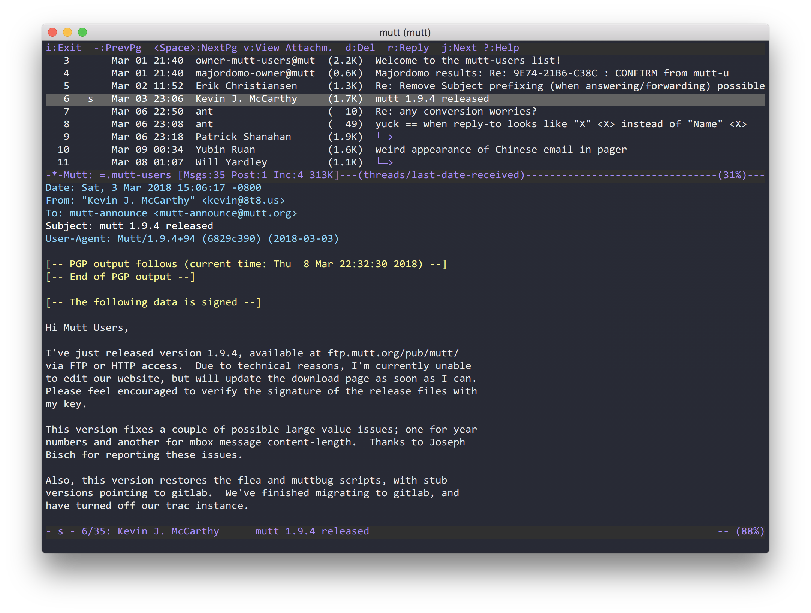

# Dracula for [Mutt](http://www.mutt.org/)

> A dark theme for [Mutt](http://www.mutt.org/).

## Install

All instructions can be found at [draculatheme.com/mutt](https://draculatheme.com/mutt).

## Team

This theme is maintained by the following person(s) and a bunch of [awesome contributors](https://github.com/dracula/mutt/graphs/contributors).

 |
--- |
[Paul Townsend](https://github.com/paultownsend) |

## License

[MIT License](./LICENSE)
